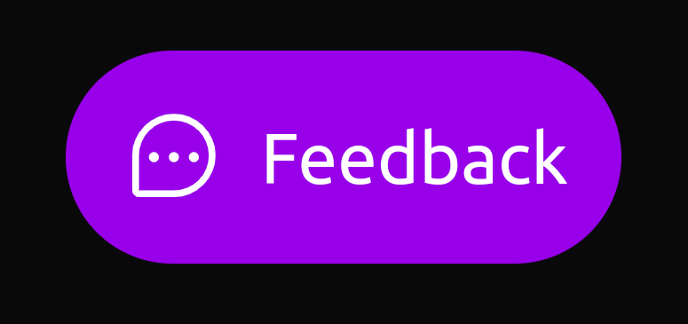

<div align="center">
  
</div>

<p align="center">
  <a href="#-projeto">Projeto</a>&nbsp;&nbsp;&nbsp;|&nbsp;&nbsp;&nbsp;
  <a href="#-técnologias">Tecnologias</a>&nbsp;&nbsp;&nbsp;|&nbsp;&nbsp;&nbsp;
  <a href="#-layout">Layout</a>&nbsp;&nbsp;&nbsp;|&nbsp;&nbsp;&nbsp;
  <a href="#-funcionalidades">Funcionalidades</a>&nbsp;&nbsp;&nbsp;|&nbsp;&nbsp;&nbsp;
  <a href="#-pré-requisitos">Pré-requisitos</a>&nbsp;&nbsp;&nbsp;|&nbsp;&nbsp;&nbsp;
  <a href="#-iniciando-o-projeto">Iniciando Projeto</a>&nbsp;&nbsp;&nbsp;
</p>

  
  
  

# ✨ *Widget-Feedbacks*

## 💻 Projeto:

Esse projeto é um Widget (elemento de interação) de Feedback que pode ser utilizado em qualquer aplicação que tenha o interesse em coletar o feedback do usuário que está utilizando o aplicação.

## 🔗 Disponivel em:

acesse: https://web-feedback-widget-dusky.vercel.app/

## 🚀 Técnologias

- [Reactjs](https://pt-br.reactjs.org/)
- [Typescript](https://www.typescriptlang.org/)
- [Tailwindcss](https://tailwindcss.com/)
- [Axios](https://axios-http.com/ptbr/docs/intro)

## 🔖 Layout

O Layout deste projeto esta acessível através deste link: https://www.figma.com/file/w7ZPZ6SlDFK7YgLperoRc9/Feedback-Widget-(Community)?node-id=100%3A3925 

## 🔨 Funcionalidades

- [X] `Tipo de feedback`: Seleção de tipo de feedback para envio.
- [X] `Descrição de feedback`: Descrição em campo de formulário para inserir detalhes qual problema/ideia/outro tipo de feedback desejavel para envio.
- [X] `Screenshot`: Captura a tela atual que se refere ao feedback.
- [X] `Envio de Feedback`: Envio deste formulario preenchido com o screenshot para o Backend fazer as devidas validações.

## 📋 Pré-requisitos

- [Nodejs > 14.15v](https://nodejs.org/en/)

#

## 💡 Este projeto é divido em três partes:

### 1. Frontend (Projeto atual)
### 2. Backend (https://github.com/AnaPerola/server_feedback_widget)
### 3. Mobile (https://github.com/AnaPerola/mobile_feedback_widget)


⚠️ Tanto o Frontend quanto o Mobile precisam que o Backend esteja sendo executado para funcionar.

#

## 🔧 Iniciando o projeto

1 - Clone o projeto
```console
$ git clone git@github.com:AnaPerola/web_feedback_widget.git
```
2 - Execute o comando para instalar todas as dependências
```console
$ npm install
```
3 - Suba o projeto 
```console
$ npm run dev
```

Se tudo ocorreu bem, visite: http://localhost:3000 😆

#

<div align="center" style="display:flex; padding:5px; ">
  
  
  
  
  
  
</div>          

---
⌨️ com ❤️ https://github.com/anaperola 😊
_juntamente com a Rocketseat no evento *NLW Return*_

---
 ✅ Concluído
##### ⭐ Marque esse projeto com uma estrela
